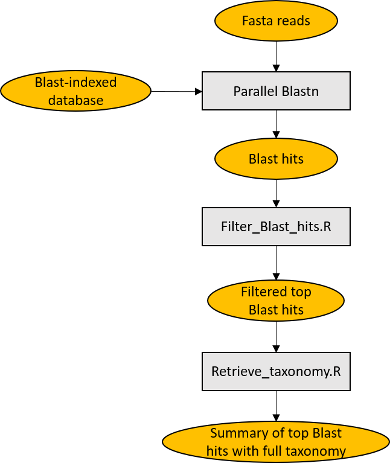

# MetaBlast

**MetaBlast** is a Metagenomic pipeline for parallel Blast analysis and report generation. After splitting the fasta file in chunks, it Blasts each read and then reports up to one top hit for each read. A simple summary file is then generated, reporting the number of reads supporting each top hit. Moreover, the full taxonomy of each top hit is retrieved.

<p align="center">
  
</p>

## Getting started

**Prerequisites**

* Miniconda3.
Tested with conda 4.9.2.
```which conda``` should return the path to the executable.
If you don't have Miniconda3 installed, you could download and install it with:
```
wget https://repo.anaconda.com/miniconda/Miniconda3-latest-Linux-x86_64.sh
chmod 755 Miniconda3-latest-Linux-x86_64.sh
./Miniconda3-latest-Linux-x86_64.sh
```

Then, after completing _MetaBlast_ installation, set the _MINICONDA_DIR_ variable in **config_MetaBlast.sh** to the full path to miniconda3 directory.

* A Blast-indexed database. For example, you may download NCBI nt db with the following instruction:

```
mkdir NCBI_nt_db
cd NCBI_nt_db
echo `date +%Y-%m-%d` > download_date.txt
wget ftp://ftp.ncbi.nlm.nih.gov/blast/db/nt*
targz_files=$(find . | grep \.tar\.gz$ | sed 's/\.\///g')
for f in $targz_files; do tar -xzvf $f; done
rm $targz_files
```

Or, in case you want to use a custom \<fasta file\>, you can create a Blast-indexed database with the following instruction:

```
makeblastdb -in <fasta file> -parse_seqids -dbtype nucl
```

**Installation**

```
git clone https://github.com/MaestSi/MetaBlast.git
cd MetaBlast
chmod 755 *
./install.sh
```

A conda environment named _MetaBlast_env_ is created, where blast, parallel and R with packages taxize and data.table are installed.
Then, you can open the **config_MetaBlast.sh** file with a text editor and set the variables _PIPELINE_DIR_ and _MINICONDA_DIR_ to the value suggested by the installation step.

## Usage

**MetaBlast.sh**

Usage:
./MetaBlast.sh -f \<sample\_name.fasta\> -db \<blast_db\>

Note: modify **config_MetaBlast.sh** before running; it can be run in background with nohup <command> &

Inputs:

* \<sample\_name.fasta\>: fasta file containing reads to be analysed
* \<blast_db\>: Blast-indexed database

Outputs:
* \<sample_name\>\_blast\_hits\_unique\_min\_id\_perc\_$MIN\_ID\_PERC\_min\_query\_cov\_$MIN\_QUERY\_COV.txt: file containing top Blast hit for each read
* \<sample_name\>\_summary\_blast\_hits\_unique\_min\_id\_perc\_$MIN\_ID\_PERC\_min\_query\_cov\_$MIN\_QUERY\_COV.txt: file containing summary of top Blast hits with full taxonomy

## Auxiliary scripts

In the following, auxiliary scripts run by **MetaBlast.sh** are listed. These scripts should not be called directly.

**config_MetaBlast.sh**

Note: configuration script, should be edited before running **MetaBlast.sh**.

**Filter_Blast_hits.R**

Note: script run by **MetaBlast.sh** for filtering Blast results, retaining up to 1 top hit for each read.

**Retrieve_taxonomy.R**

Note: script run by **MetaBlast.sh** to retrieve the full taxonomy for each top hit.


## Citations

Please refer to the following manuscripts for further information.

Tange, O. (2020, September 22). GNU Parallel 20200922 ('Ginsburg'). Zenodo. https://doi.org/10.5281/zenodo.4045386

Altschul, S.F., Gish, W., Miller, W., Myers, E.W. & Lipman, D.J. (1990) "Basic local alignment search tool." J. Mol. Biol. 215:403-410.

Scott Chamberlain, Eduard Szocs (2013). “taxize - taxonomic search and retrieval in R.” F1000Research.
